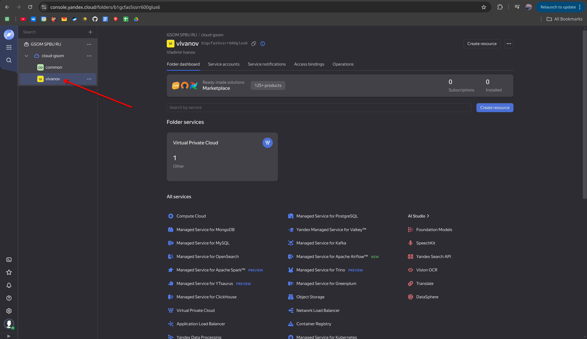
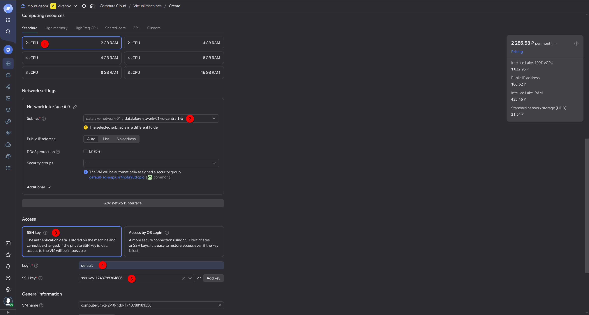

# Week 9: Yandex Cloud. Autodeploy.

## Step 0. Preparation
### SSH

**SSH (Secure Shell)** is used to securely connect to remote servers via terminal interface.

**Basic usage:**
```bash
ssh username@remote_host
```

- username: your user on the remote machine
- remote_host: IP address or hostname

Useful options:

- -i /path/to/key: specify a private key file
- -p PORT: connect to a different port (default is 22)

### SCP
**SCP (Secure Copy Protocol)** is used to securely transfer files between local and remote machines.

**Copy a local file to a remote server:**
```bash
scp file.txt username@ip:/remote/path/
```

**Copy a file from a remote server to local:**

```bash
scp username@ip:/remote/file.txt /local/path/
```

**Useful options:**

- -r: copy directories recursively
- -P PORT: specify port (note uppercase -P)
- -i /path/to/key: specify a private key file

### Key generation

**To generate a new SSH key pair (for example, named "deploy"):**
```bash
ssh-keygen -t rsa -f ~/.ssh/deploy
```

- `-t rsa`: key type (RSA)
- `-f ~/.ssh/deploy`: output file for the private key

This creates two files:
- `~/.ssh/deploy`: your private key (keep it safe!)
- `~/.ssh/deploy.pub`: your public key (can be shared)

We would add the public key (`deploy.pub`) to the remote server's `~/.ssh/authorized_keys` to enable key-based authentication.

## Step 1. Creating VM on cloud. 
### 1. Login in cloud. Enter your folder. 


### 2. Create VM instance.


### 3. Select machine parameters. 


You can select any login, in future you will use it to connect to VM. 
As SSH key upload created `deploy.pub` from `~/.ssh/` folder.



After the machine is created you would be able to see its parameters.


You can click on it: 


To connect to your machine you can use command on the image above or the following one: 
```bash
ssh user@public_ip -i ~/.ssh/deploy
```

## Step 2. Move project files to VM. 
In order to keep only necessary files on VM, let us write the script that would transfer files via SCP: 
`scripts/send_to_remote.sh`
```bash
#!/bin/bash

IP_ADDR="$1"

ssh -i ~/.ssh/deploy default@"$IP_ADDR" "mkdir -p ~/project" 
scp -i ~/.ssh/deploy -r ./backend default@"$IP_ADDR":~/project/ 
scp -i ~/.ssh/deploy -r ./frontend default@"$IP_ADDR":~/project/
scp -i ~/.ssh/deploy -r ./models default@"$IP_ADDR":~/project/
scp -i ~/.ssh/deploy -r ./docker-compose.yaml default@"$IP_ADDR":~/project
```

This script takes ip address of remote machine, creates directory `project`, and transfers only **necessary** files to VM. 

### Try to run application

As all application is wrapped in docker containers, we only need to install docker as written [here](https://docs.docker.com/engine/install/ubuntu/#install-using-the-repository).


```bash
# Add Docker's official GPG key:
sudo apt-get update
sudo apt-get install ca-certificates curl
sudo install -m 0755 -d /etc/apt/keyrings
sudo curl -fsSL https://download.docker.com/linux/ubuntu/gpg -o /etc/apt/keyrings/docker.asc
sudo chmod a+r /etc/apt/keyrings/docker.asc

# Add the repository to Apt sources:
echo \
  "deb [arch=$(dpkg --print-architecture) signed-by=/etc/apt/keyrings/docker.asc] https://download.docker.com/linux/ubuntu \
  $(. /etc/os-release && echo "${UBUNTU_CODENAME:-$VERSION_CODENAME}") stable" | \
  sudo tee /etc/apt/sources.list.d/docker.list > /dev/null
sudo apt-get update
```

```bash
sudo apt-get install docker-ce docker-ce-cli containerd.io docker-buildx-plugin docker-compose-plugin
```

**Run app**
```bash
cd ~/project
sudo docker compose up -d --build  
```

Visit `http://ip:port` to see whether you application is working. 

## Step 3. Autodeploy.
All the steps we did now, can be done automatically from the github CI (actions).

### 1. Setup secrets on github. 
In order to not to push sensitive (passwords, keys, ip's...) data to the github, we can put them as secrets (similar to Airflows variables).

We need to put here `SERVER_IP` and `SSH_KEY` (private). After that our secrets would be accesible in github actions terminal commands as `{{ SERVER_IP }}`. 

### 2. Write action for the deploy. 
```yml
name: Deploy

on:
  push:
    branches:
      - main
  workflow_dispatch:

jobs:
  deploy:
    runs-on: ubuntu-latest
    steps:
      - name: Checkout repository
        uses: actions/checkout@v4

      - name: Set up SSH key
        uses: webfactory/ssh-agent@v0.8.0
        with:
          ssh-private-key: ${{ secrets.SSH_KEY }}

      - name: Test SSH connection
        run: |
          ssh -o StrictHostKeyChecking=no default@${{ secrets.SERVER_IP }} 'echo "SSH connection successful"' 

      - name: Copy files to server
        run: |
          bash scripts/send_to_remote.sh ${{ secrets.SERVER_IP }}

      - name: Stop running containers
        run: |
          ssh -o StrictHostKeyChecking=no default@${{ secrets.SERVER_IP }} 'cd /home/default/project && sudo docker compose down'

      - name: Deploy with Docker Compose
        run: |
          ssh -o StrictHostKeyChecking=no default@${{ secrets.SERVER_IP }} 'cd /home/default/project && sudo docker compose up -d --build'
```